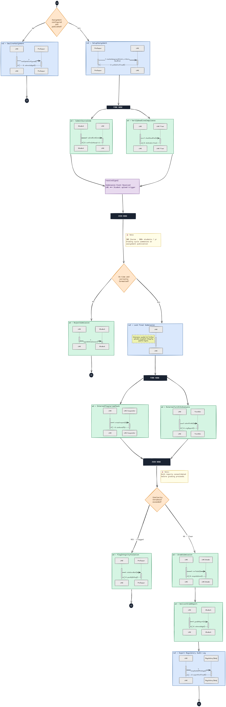
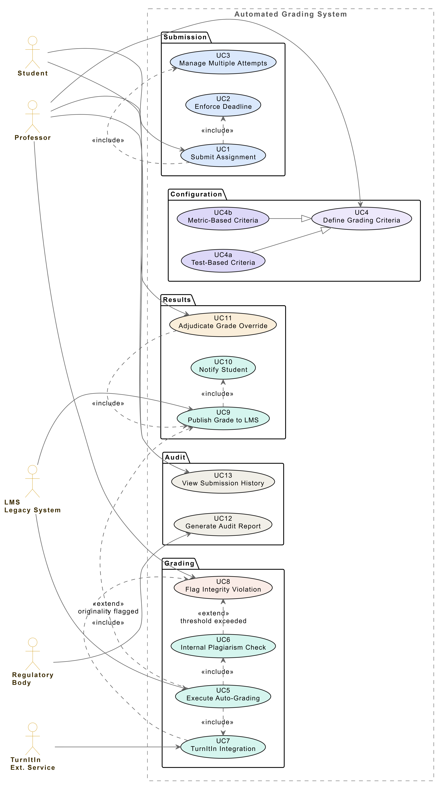
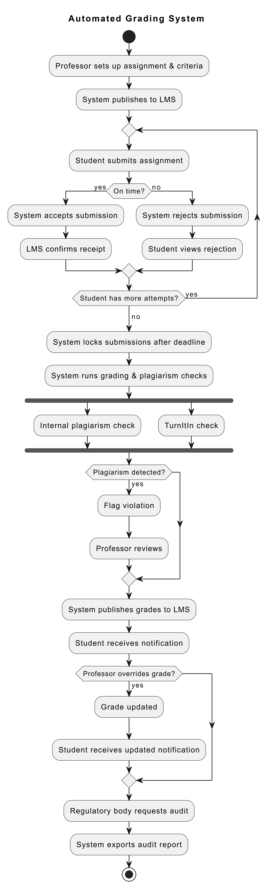

# UML Diagrams for Automated Grading System — Report

## 1. Introduction

**What is happening now:**
- A University's Software Engineering course has 300+ students each year
- Professors manually grade programming assignments
- Process involves cloning GitHub repos, running code locally, inspecting manually
- Takes too much time
- Hard to keep consistent records
- No automated grading tools in place
- No plagiarism detection used

**What this report does:**
- Proposes an Automated Grading System (AGS)
- System will:
  - Run student code automatically
  - Check for plagiarism
  - Send grades to existing LMS
  - Keep records for audits

**How analysis is structured:**
- First diagram: shows Interaction Overview Diagram(IoD) from an Actor-to-Actor 
perspective towards a business outcome first
- Second diagram: Defines functional use 
case(UCD) of what the system would need to support the 
interactions
- Third diagram: shows how everything works together with the new system

---

## 2. Requirements Analysis

### 2.1 Problem Context

- University has an old mainframe LMS
- Changing it is difficult and expensive
- IT budget is small
- Cannot buy expensive commercial platforms
- Grades must be accurate and defensible
- Regulatory body audits grades every year

### 2.2 Stakeholders and Actors

| Actor | Role |
|---|---|
| **Student** | Submits code; receives grades and feedback |
| **Professor** | Sets up assignments; reviews plagiarism flags; changes grades if needed |
| **LMS (Legacy)** | Posts assignments; stores grades |
| **TurnItIn** | Checks code for plagiarism |
| **Regulatory Body** | Reviews grade records annually |

### 2.3 Functional Requirements

| ID | Requirement |
|---|---|
| FR1 | Students upload source code; system runs and grades it automatically |
| FR2 | System saves all grades and submission records |
| FR3 | System checks for plagiarism internally (against other students) and externally (via TurnItIn) |
| FR4 | System sends grades to the existing LMS |
| FR5 | Professors set deadlines; system rejects late submissions automatically |
| FR6 | Students can submit multiple times; system keeps best or final grade |
| FR7 | Professors define grading criteria (test cases and code quality metrics) |

### 2.4 Non-Functional Requirements

| Attribute | What It Means |
|---|---|
| **Auditability** | Every action is logged with timestamp; regulators can access all records |
| **Reliability** | Deadline enforcement works automatically; no manual steps |
| **Scalability** | System handles 300+ students submitting around the same time |
| **Security** | Student code runs in isolated environment; cannot damage the system |
| **Interoperability** | Works with old LMS through simple connections; no major changes to LMS needed |
| **Maintainability** | Professors configure grading rules per assignment; no coding required |

---

## 3. Architectural Design

### 3.1 Interaction Overview Diagram — Actor-to-Actor (Context Viewpoint)

**What this diagram shows:**

The current workflow relies on a monolithic LMS to orchestrate a complex sequence of events: receiving submissions, managing deadlines, coordinating with internal and external integrity services, automating grading, and handling compliance reporting. This centralized logic creates dependencies where a failure in the LMS can halt the entire grading pipeline.

**Sequence 1 — Professor Sets Up Assignment**

- Professor → LMS: The professor creates the assignment, providing the rubric, grading criteria, and deadline.  

- LMS → Professor: The LMS confirms that the assignment has been configured and published successfully.  

**Sequence 2 — Assignment Rejected (Configuration Failure)**

- LMS → Professor: If the assignment is not correctly configured (e.g., missing rubric or criteria), the LMS sends a "notifyNotConfigured" message to the professor.  

- Professor → LMS: The professor acknowledges the notification, presumably after correcting the configuration.  

**Sequence 3 — Student Submits Code**

- Student → LMS: The student uploads their source code for the assignment.  

- LMS → Student: The LMS confirms receipt and notes the submission attempt number (e.g., attempt 1, 2, etc.).  

**Sequence 4 — Deadline Check (LMS Timer)**

- LMS Timer → LMS: The timer service queries the LMS to verify whether the submission was made before the deadline.  

- LMS → LMS Timer: The LMS responds with the status (e.g., "on-time" or "late").  

**Sequence 5 — Valid Submission Triggers Integrity & Grading Pipeline**

- LMS → Internal Comparator: The LMS sends the submission to the internal LMS Comparator for cross-referencing against other submissions to generate a similarity score.  

- LMS → TurnItIn: Simultaneously, the LMS sends the submission to TurnItIn to generate an originality report.  

**Consolidation Note:**
 The results from both plagiarism checks are consolidated before grading proceeds.  

**Decision Point — Similarity Threshold**

- **If threshold is exceeded:** The LMS flags an integrity violation and sends a "violationAlert" and "penaltyRuling" to the Professor.  
- **If threshold is not exceeded:** The submission is considered clear and proceeds to grading.  

**Sequence 6 — Grading & Score Calculation**

- LMS Grader → LMS: The grader runs automated tests on the submission and computes the final score.  

- LMS → Student: The final grade is delivered to the student.  

**Sequence 7 — Compliance & Audit Trail**

- LMS → Regulatory Body: The LMS compiles a complete audit package (including submission details, integrity reports, and the final grade) and exports it to the regulatory body for compliance records.  

- Regulatory Body → LMS: The regulatory body confirms receipt of the audit logs.  

**Key Takeaways**

- The LMS acts as the central orchestrator, managing all interactions: assignment setup, submission handling, deadline enforcement, plagiarism detection, grading, and audit reporting.  

- Deadline enforcement is delegated to a separate timer service, but the LMS still controls the logic for determining late vs. on-time submissions.  

- Plagiarism detection is split between an internal comparator (for peer similarity) and an external service (TurnItIn), with results consolidated before grading.  

- The workflow includes a manual intervention point where the professor is alerted to configuration errors and integrity violations, requiring acknowledgment before the process continues.  

- All actions are logged for regulatory compliance, with a final audit package exported after grading is complete.  

- The process is largely automated once a valid submission passes the deadline check, but it relies heavily on the LMS to maintain state and orchestrate calls to multiple external services.

---

### 3.2 Use Case Diagram — Functional Viewpoint

[](https://uml.planttext.com/plantuml/svg/pLZTRk8u5Bv7uXsEc8lTlMYtWTBIrGYDWT0YyLCHcDsH8erCOeAtmK6ECrDsjz8yn3pXFCaUcm19-P5Mcbc8UcEVy_aSV-V7XxwB5PKgcOT04XNDgMB-ntj9VIw2ZyuoLcnUB1GByHCN2ohf72RKUmfab0Y_6OMHX3TjysLLV3QbIQZQaL1zEcT09AVX0GM7_yN0AkTjK4_XoNyN2m2DL-QKf296BIQK4KVIPpBrf7LDhifNUbkVd6vMI9bSRJOTjGmPJABGBnPUyaQJc7aqPgbPS-venhqdmU8OhClo3a0oJr4HXEo_UrepttPxvPPFundpN_bVDT_6VqDNPSSN8cNqEKNSc6z7chcCnePiga1587amK-1pVHiU2ItwwTlNBwVwG-lmCEwHFf3cQ31quDkNhs1y_TbdNeXq-j3k39tHBwVsSvMa9KSbFeQu100q1cSqtaWUPJH5kYDPqfB7uQ1z3kGw7voHtOF6ODnlaU67KpkqBQBIflz0sdzWrNyCVUJUqMMcwo1r69naCkTnZ4aBtzihW0LMCmtGgwsL4hpvVSPLMkwmQHYbSTDoXT5JG50r4FCq8rOVkeygW0sAsBLsSmTTTeKjff7q6BGOzKCks1QyGfSFeokkw56XVUrXJ-KBf98ef6sXubAAhkJGBtaQcv6OyY2HL7qt9dC4viu_mk6rArfiYdVVXByfKHFVZjAQXMkyXzt2UpHsqTGL8nQhYmPk-3de1asGXLQhrgxjeYT88bEIU_lmAtGZYtx5uThZ7rOc6JvJMqUOh68-FJClGQ6kgOiD8fjHLPqJrNRLjdVmDwxe2Bo-e24yXZJWLF9u3iqPyvusiRWvZB_5K2HIT5H7W3ueMCS-Q__sCBxcYZQQJR5SBU4zZyBj6GPVGtoRs4txTayyXYp6MeZ_btYajex4uyuLZyaavF7C90hJpswtv-Jvk3lCXtNbYdwa-7G9cTVcLOUmhWxZiJqH_y_4vnwsrzI7mISc9VVPkaTObk7JRf4zV1B4gX_5vXvEZRrZ_HPRvZqJJ5AJuzgv8Lj4KcNhtIhZZIoxRU_MkuLDyprddxDlo0EFyTbURZFCgcJnB-dCTUhts_vZP0_xf0k_hf_opA1aXZcjjHsMI1lrGSrOPbwTw2cLogNMX3ZIHIxKkDU5HKWz5cljEI0b1gMFF9TX2wl65LqMK6-v6GxIUA68RFJMxKStGdK93fEVkCVC837gTBPwGnOas5WmxAveHFwojAseeNrFpY7U9hf076VGx91HPz1tJkqJphW05nTrNIBv5VukqMDkkhpEhMgvbMNbbuZK0KoNrTpghbZGGKjNsEvrQDR0yZd4gDDlTiSj6tEckmhHG-Vnv64o8-TbVJKy_WPlttBXXVXwrEjPMMMFh9hARex8Re_8xlR8xb8PFbExlbY7SEVHRlkjSuliJSfcpH36dXKJVhtk2ZMJB9v5eG_isMFCr_zDCB7QgnrXR-SuvEa9Que3Lw3LJq_vlTstXwJRSGpZfoVxMZURVzAEPdu8R9V5mZiaCvc7_m80)

**What this diagram shows:**
- All the things the new system must do
- Organized by related functions

**Submission Package (What students do):**

| Use Case | Description |
|---|---|
| UC1 Submit Assignment | Student uploads code |
| UC2 Enforce Deadline | System checks time; rejects late submissions |
| UC3 Manage Multiple Attempts | System tracks attempt numbers; keeps history |

**Configuration Package (What professors set up):**

| Use Case | Description |
|---|---|
| UC4 Define Grading Criteria | Professor sets how assignment will be graded |
| UC4a Test-Based Criteria | Professor provides test cases; system runs them |
| UC4b Metric-Based Criteria | Professor sets quality rules (code complexity, test coverage) |

**Grading Package (What system does automatically):**

| Use Case | Description |
|---|---|
| UC5 Execute Auto-Grading | Runs tests and metrics on student code |
| UC6 Internal Plagiarism Check | Compares submission against other students in same class |
| UC7 TurnItIn Integration | Sends code to TurnItIn; gets originality report |
| UC8 Flag Integrity Violation | Alerts professor if plagiarism detected |

**Results Package (Grades and notifications):**

| Use Case | Description |
|---|---|
| UC9 Publish Grade to LMS | Pushes final grade to mainframe system |
| UC10 Notify Student | Sends grade notification |
| UC11 Adjudicate Grade Override | Professor changes grade; system updates LMS |

**Audit Package (Record keeping):**

| Use Case | Description |
|---|---|
| UC12 Generate Audit Report | Regulatory body pulls all records for review |
| UC13 View Submission History | Professors and students see attempt history |

---

### 3.3 Interaction Overview Diagram — System-Supported (Solution Viewpoint)

[](https://uml.planttext.com/plantuml/svg/RPDDRjj038Nt1dm7hW9dqGjOG9DiMXXeqQ3E1SOQIc8ZpQWanwbl7ux-hCPPoJ8VFvAFrAEeOqrTkzqeQOlmb3HsJj73TtQUGWt7YoXssyrsCsZpZ_qpnmf58eEW2gGUd0ZLeSEWS0SbaoAJAqmwfaEVJYr9Wm8QuSVFOv4vZ3qw8mBiZvfyJfPqwiYGLrwHurJ1xbS0fGuVxa4R3B2xeDpdMCuUYxYonDwI1uW1OYWcWLM4CeQAk1DWB97w4Ooj8En2_41Y_8FbfwIvqJFXcqowEOp1KpMF1MyDcQ6xEQ5n0bra1ATMmTgqGKZcCRvy3N7mPEwWZUNhkhvPKfcfuD7vbWAklELaqNfQrntqhQl9CKa7POD66RXLvDV1wKCmJ73jZQuOHU1gHs6GlYGE1ps49Mu3mWZQRl9Adgy8ZsfEeBzPp_wRYSoksBh5gDK1CGvEZl3itcStauTRdywoXM6LPmk5g5HHEPUOsbkgn3CoavzHjqtcQqSxP9zll_Zl99SQK_HZhMlVlx5EDcNa2voYlrZctuIIhpbvqjN6y5yVUVxVPFcj63-nsEVdeq7jgtm7)

**What this diagram shows:**
- How everything works together with the system
- Complete workflow from start to finish

**Phase 1 — Assignment Setup:**
- Professor logs into system
- Creates assignment
- Sets test cases or metrics
- Sets deadline
- System checks if everything is configured
- If yes: publishes to LMS
- If no: asks professor to complete setup

**Phase 2 — Student Submissions:**
- Student uploads code
- System checks deadline
- Two things happen at same time:
  - LMS receives submission
  - Timer verifies deadline
- If late: rejection notice sent
- If on time:
  - System accepts submission
  - LMS confirms receipt
- Student can submit multiple times
- After final submission:
  - System locks it
  - No more changes allowed
  - Grading begins automatically

**Phase 3 — Plagiarism Detection:**
- Two checks run at same time:
  - Internal: compares against all other students in class
  - External: sends to TurnItIn for originality report
- Both results come back
- System checks similarity scores
- If threshold exceeded:
  - Flag created
  - Professor notified to review
- If no violation:
  - Proceeds to grading

**Phase 4 — Grading:**
- System runs test cases provided by professor
- System checks code quality metrics
- Calculates final grade
- Publishes grade to LMS
- Student gets notification

**Phase 5 — Grade Override (if needed):**
- Professor reviews grade
- If override needed:
  - Professor changes grade in system
  - System updates LMS
  - Student gets updated notification

**Phase 6 — Audit:**
- Regulatory body requests records
- System exports:
  - All submissions
  - All grades
  - All plagiarism reports
  - All timestamps
- Export ready for review

---

## 4. Quality Attributes Consideration

**Auditability — How system meets it:**
- Every submission creates a record
- Every grade calculation is logged
- Every plagiarism check is saved
- Timestamps on all actions
- Export function gives regulators everything they need

**Reliability — How system meets it:**
- Deadline check happens automatically on every submission
- System locks submissions after deadline
- No professor action needed to enforce deadlines
- Grading starts automatically after final submission

**Scalability — How system meets it:**
- Plagiarism checks run in parallel (not one after another)
- Internal check and TurnItIn check happen at same time
- Reduces wait time for each student
- Handles 300+ submissions without delays

**Security — How system meets it:**
- Student code runs in containers (like small isolated boxes)
- Code cannot access main system files
- Cannot affect other students' submissions
- Cannot damage university systems

**Interoperability — How system meets it:**
- Uses simple messages to talk to LMS
- No need to rewrite LMS code
- LMS only needs to accept grade data
- Works within university's budget constraints

**Maintainability — How system meets it:**
- Professors configure grading rules through interface
- No programming required for new assignments
- Test cases uploaded as files
- Metrics selected from dropdown menus
- System code does not change when new assignments added

---

## 5. Discussion

**Why three diagrams?**
- First diagram (actor-to-actor): shows real-world workflow without system assumptions
- Validates that we understood the problem correctly
- Second diagram (use case): lists everything system must do
- Third diagram (system-supported): shows how system enables the workflow
- Each diagram builds on previous one

**Biggest challenge — old LMS:**
- Mainframe system is old
- Cannot change it easily
- Solution: treat LMS as read-only where possible
- AGS handles business logic (deadlines, attempt tracking)
- LMS only stores final grades
- Increases AGS complexity but necessary

**Plagiarism detection approach:**
- Two methods are better than one
- Internal check catches copying between students
- TurnItIn catches code from internet or other institutions
- Risk: TurnItIn might go down
- Solution: if TurnItIn unavailable, proceed with internal check only
- Flag TurnItIn as pending; recheck later

**Technology choices:**
- University budget is tight
- Open-source tools available:
  - Docker for running code safely
  - Open-source plagiarism tools
  - Simple API connections to LMS
- No expensive licenses needed

---

## 6. Conclusion

**What was accomplished:**

**Requirements:**
- Identified 5 actors (Student, Professor, LMS, TurnItIn, Regulatory Body)
- Documented 7 functional requirements
- Defined 6 quality attributes

**Diagrams produced:**
- Actor-to-actor IoD: showed real-world interactions
- Use Case Diagram: listed 13 system functions across 5 packages
- System-supported IoD: showed complete end-to-end workflow

**Quality attributes addressed:**
- Auditability: all actions logged and exportable
- Reliability: automated deadline enforcement
- Scalability: parallel processing for 300+ students
- Security: sandboxed code execution
- Interoperability: lightweight LMS integration
- Maintainability: configuration over code

**What the system achieves:**
- Eliminates manual grading work for professors
- Provides consistent, auditable grading records
- Detects plagiarism automatically
- Meets regulatory requirements
- Works within university budget
- Respects existing infrastructure limits

---

## 7. References

GeeksforGeeks. (n.d.). Interaction overview diagrams unified modeling language (UML). https://www.geeksforgeeks.org/interaction-overview-diagrams-unified-modeling-language-uml/

GeeksforGeeks. (n.d.). Use case diagram. https://www.geeksforgeeks.org/use-case-diagram/

Visual Paradigm. (n.d.). What is interaction overview diagram? https://www.visual-paradigm.com/guide/uml-unified-modeling-language/what-is-interaction-overview-diagram/

Excalidraw. (n.d.). Excalidraw: Virtual whiteboard for sketching hand-drawn like diagrams. https://excalidraw.com/

Mermaid. (n.d.). Mermaid: Diagramming and charting tool. https://mermaid.js.org/

PlantText. (n.d.). PlantText: Online PlantUML editor. https://www.planttext.com/

PlantUML. (n.d.). PlantUML: Open-source tool that uses simple textual descriptions to draw UML diagrams. https://plantuml.com/

